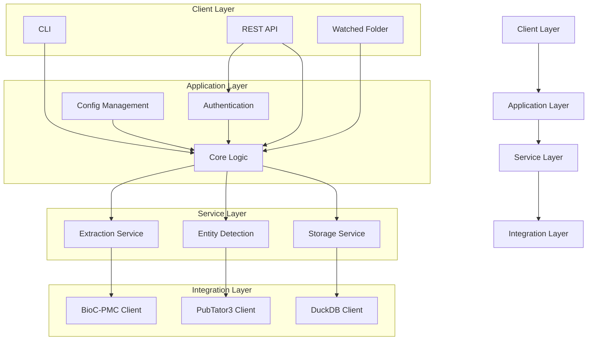

# Design Document: Scientific Publication Data Extraction System

## 1. System Overview

The Scientific Publication Data Extraction System is designed to extract, store, and provide access to scientific publication metadata with a focus on figure captions and related entities. This document outlines the architecture, components, data flow, and technical decisions for implementing this system.

### 1.1 System Purpose

The system will extract the following information from scientific publications:
- Title
- Abstract
- Figure captions
- Figure URLs (when available)
- Key entities (e.g., genes) mentioned in figure captions

Initially focused on PubMed Central (PMC) publications, the system is designed to be extensible to additional data sources in the future.

## 2. Architecture

### 2.1 High-Level Architecture

The system follows a layered architecture with clear separation of concerns:



### 2.2 Component Descriptions

#### 2.2.1 Client Layer

**Command Line Interface (CLI)**

- Purpose: Provide users and admins with command-line access to system functionality
- Key Functions:

- Submit paper IDs for processing
- Query extracted data
- Configure system settings
- Run batch jobs
- Export data in JSON/CSV formats


**REST API**

- Purpose: Enable programmatic access to the system
- Key Functions:

- Authentication and authorization
- Paper submission endpoints
- Data query endpoints
- Status and monitoring endpoints
- Configuration endpoints (admin only)
- Data export endpoints (JSON/CSV)


**Watched Folder**

- Purpose: Automatically process files placed in specified directories
- Key Functions:

- Monitor directories for new files
- Parse files for paper IDs
- Submit IDs for processing
- Record processing status


#### 2.2.2 Application Layer

**Authentication Service**

- Purpose: Secure access to the system
- Key Functions:

- API key validation
- User permission management
- Access control for admin functions


**Core Logic**

- Purpose: Orchestrate the overall data flow
- Key Functions:

- Coordinate extraction, entity detection, and storage
- Manage job queues and task distribution
- Handle errors and retries
- Implement business logic for data processing


**Configuration Management**

- Purpose: Manage system settings
- Key Functions:

- Store and retrieve configuration
- Validate configuration changes
- Apply configuration updates across components


#### 2.2.3 Service Layer

**Extraction Service**

- Purpose: Extract metadata from scientific publications
- Key Functions:

- Connect to data sources (initially PMC)
- Parse publication structure
- Extract titles, abstracts, figure captions, and URLs
- Transform data into standardized format


**Entity Detection Service**

- Purpose: Identify key entities in figure captions
- Key Functions:

- Process text for entity recognition
- Connect to PubTator3 API
- Filter and categorize entities
- Link entities to their source text


**Storage Service**

- Purpose: Manage persistent data storage
- Key Functions:

- Store extracted metadata
- Query and retrieve data
- Manage database schema
- Handle data updates and versioning


#### 2.2.4 Integration Layer

**BioC-PMC Client**

- Purpose: Interface with NCBI BioNLP API
- Key Functions:

- Retrieve paper structure
- Handle API rate limiting
- Process BioC XML format
- Error handling for API interactions


**PubTator3 Client**

- Purpose: Interface with PubTator3 API
- Key Functions:

- Submit text for entity detection
- Process API responses
- Handle rate limiting
- Error handling for API interactions


**DuckDB Client**

- Purpose: Interface with DuckDB database
- Key Functions:

- Create and maintain database schema
- Execute queries efficiently
- Manage database connections
- Handle data persistence


## 3. Data Models

### 3.1 Paper Model

```plaintext
Paper {
    id: string (PMC or PMID)
    title: string
    abstract: string
    processed_date: datetime
    source: string (e.g., "PMC")
    status: enum ["pending", "processing", "completed", "failed"]
    error_message: string (null if no error)
}
```

### 3.2 Figure Model

```plaintext
Figure {
    id: string
    paper_id: string (foreign key to Paper)
    figure_number: int
    caption: string
    url: string (null if not available)
}
```

### 3.3 Entity Model

```plaintext
Entity {
    id: string
    figure_id: string (foreign key to Figure)
    entity_text: string
    entity_type: string (e.g., "gene", "disease")
    start_position: int
    end_position: int
    external_id: string (e.g., gene ID)
}
```

### 3.4 Job Model

```plaintext
Job {
    id: string
    job_type: string
    status: enum ["queued", "processing", "completed", "failed"]
    created_at: datetime
    completed_at: datetime
    paper_ids: array<string>
    total_papers: int
    processed_papers: int
    failed_papers: int
}
```

## 4. Data Flow

### 4.1 Ingestion Flow

1. User submits paper IDs via CLI, API, or by placing a file in a watched folder
2. System creates a job and queues paper IDs for processing
3. For each paper ID:
a. Extraction Service retrieves paper structure from BioC-PMC API
b. System extracts title, abstract, and figure captions
c. For each figure caption, Entity Detection Service identifies key entities
d. Storage Service persists all extracted data
4. System updates job status and notifies user of completion


### 4.2 Query Flow

1. User submits query via CLI or API with authentication
2. System validates authentication
3. Storage Service executes query against database
4. System formats results in requested format (JSON/CSV)
5. Results are returned to the user


## 5. Technical Decisions & Dependencies

### 5.1 Programming Language

- **Decision**: Python 3.9+
- **Justification**: Excellent libraries for scientific data processing, API interactions, and web services. Strong community support for NLP and bioinformatics tasks.


### 5.2 Web Framework

- **Decision**: FastAPI
- **Justification**: Modern, high-performance async framework with automatic OpenAPI documentation. Type checking and validation reduce errors.


### 5.3 CLI Framework

- **Decision**: Typer (based on Click)
- **Justification**: Creates professional CLI interfaces with minimal code. Good integration with FastAPI's data models.


### 5.4 Database

- **Decision**: DuckDB
- **Justification**: As specified in requirements. Provides SQL interface with good performance for analytical queries and is file-based for simple deployment.


### 5.5 ORM

- **Decision**: SQLAlchemy
- **Justification**: Mature ORM with excellent features for database management. Works well with FastAPI and supports DuckDB.


### 5.6 API Clients

- **Decision**: httpx
- **Justification**: Modern async HTTP client with better features than requests. Supports both sync and async patterns.


### 5.7 Task Queue

- **Decision**: Celery with Redis backend
- **Justification**: Mature distributed task queue for handling background processing of papers. Redis provides fast, reliable queue backing.


### 5.8 Containerization

- **Decision**: Docker with Docker Compose
- **Justification**: Industry standard for containerization. Docker Compose simplifies multi-container deployment.


### 5.9 Testing Framework

- **Decision**: pytest
- **Justification**: Powerful, flexible testing framework with excellent plugin ecosystem.


### 5.10 Documentation

- **Decision**: Sphinx with ReadTheDocs theme
- **Justification**: Industry standard for Python documentation with good support for API documentation.


## 6. API Endpoints

### 6.1 Authentication

- POST /api/v1/auth/token - Get API token with credentials


### 6.2 Papers

- POST /api/v1/papers - Submit paper IDs for processing
- GET /api/v1/papers - List all processed papers
- GET /api/v1/papers/paper_id - Get details for specific paper
- GET /api/v1/papers/paper_id/figures - Get figures for specific paper


### 6.3 Figures

- GET /api/v1/figures - List all figures
- GET /api/v1/figures/figure_id - Get specific figure details
- GET /api/v1/figures/figure_id/entities - Get entities for specific figure


### 6.4 Entities

- GET /api/v1/entities - List all entities
- GET /api/v1/entities/type - List entities of specific type


### 6.5 Jobs

- GET /api/v1/jobs - List all jobs
- GET /api/v1/jobs/job_id - Get specific job status
- POST /api/v1/jobs/job_id/cancel - Cancel specific job


### 6.6 Export

- GET /api/v1/export/papers - Export papers data (CSV/JSON)
- GET /api/v1/export/figures - Export figures data (CSV/JSON)
- GET /api/v1/export/entities - Export entities data (CSV/JSON)


### 6.7 Admin

- GET /api/v1/admin/config - Get current configuration
- PUT /api/v1/admin/config - Update configuration
- GET /api/v1/admin/stats - Get system statistics


## 7. Configuration Options

### 7.1 General Configuration

- app_name: Application name
- environment: Development, testing, or production
- log_level: DEBUG, INFO, WARNING, ERROR, CRITICAL
- temp_dir: Directory for temporary files


### 7.2 API Configuration

- api_host: Host to bind API server
- api_port: Port to bind API server
- api_workers: Number of worker processes
- enable_docs: Enable/disable API documentation


### 7.3 Security Configuration

- auth_enabled: Enable/disable authentication
- auth_method: "api_key" or "password"
- api_keys: List of valid API keys
- token_expiration: Token expiration time in seconds


### 7.4 Storage Configuration

- storage_type: "duckdb" (default, expandable)
- duckdb_path: Path to DuckDB file
- backup_enabled: Enable/disable backups
- backup_interval: Backup interval in hours


### 7.5 Processing Configuration

- extraction_workers: Number of extraction workers
- entity_detection_workers: Number of entity detection workers
- batch_size: Number of papers to process in a batch
- retry_limit: Number of retries for failed API calls
- retry_delay: Delay between retries in seconds


### 7.6 Watched Folder Configuration

- watched_folders: List of folders to watch
- watch_interval: Interval to check folders in seconds
- file_patterns: List of file patterns to process


### 7.7 External API Configuration

- bioc_pmc_url: URL for BioC-PMC API
- bioc_pmc_rate_limit: Rate limit for BioC-PMC API
- pubtator3_url: URL for PubTator3 API
- pubtator3_rate_limit: Rate limit for PubTator3 API


## 8. Deployment Diagram

```
graph TD
    A["User"] --> B["Load Balancer"]
    B --> C["API Server"]
    B --> D["API Server"]
    C --> E["Redis"]
    D --> E
    E --> F["Worker"]
    E --> G["Worker"]
    F --> H["DuckDB"]
    G --> H
    F --> I["BioC-PMC API"]
    G --> I
    F --> J["PubTator3 API"]
    G --> J
    K["Admin"] --> L["CLI"]
    L --> H
    M["Watched Folder"] --> N["File System"]
    N --> O["Watcher Process"]
    O --> E
```

## 9. Security Considerations

### 9.1 Authentication & Authorization

- API key or password authentication for all endpoints
- Admin endpoints restricted to admin users
- API keys stored securely (hashed)
- Token-based authentication with expiration


### 9.2 Data Security

- No storage of sensitive user data
- Proper error handling to avoid information leakage
- Input validation for all API endpoints
- Rate limiting to prevent abuse


### 9.3 Dependency Security

- Regular updates of dependencies
- Vulnerability scanning in CI/CD pipeline
- Minimal permissions principle in containerization


## 10. Scalability Considerations

### 10.1 Horizontal Scaling

- Stateless API design allows multiple instances
- Task queue enables distributed processing
- Database can be externalized for shared access


### 10.2 Performance Optimization

- Batch processing for efficient API usage
- Caching of frequent queries
- Async I/O for API and database operations
- Background tasks for long-running processes


### 10.3 Resource Management

- Rate limiting for external API calls
- Connection pooling for database
- Monitoring and alerting for resource usage


## 11. Future Extensibility

### 11.1 New Data Sources

- Pluggable data source architecture
- Standardized extraction interface
- Configuration-driven source selection


### 11.2 Enhanced Entity Recognition

- Support for additional entity types
- Pluggable entity recognition engines
- Machine learning integration possibilities


### 11.3 Advanced Querying

- Full-text search capabilities
- Advanced filtering and aggregation
- Query language extensions


## 12. Conclusion

This design document outlines a comprehensive approach to building the Scientific Publication Data Extraction System. The modular architecture ensures extensibility for future requirements, while the chosen technologies provide a robust foundation for development. The system is designed to meet all the specified requirements while maintaining good performance, security, and usability.
