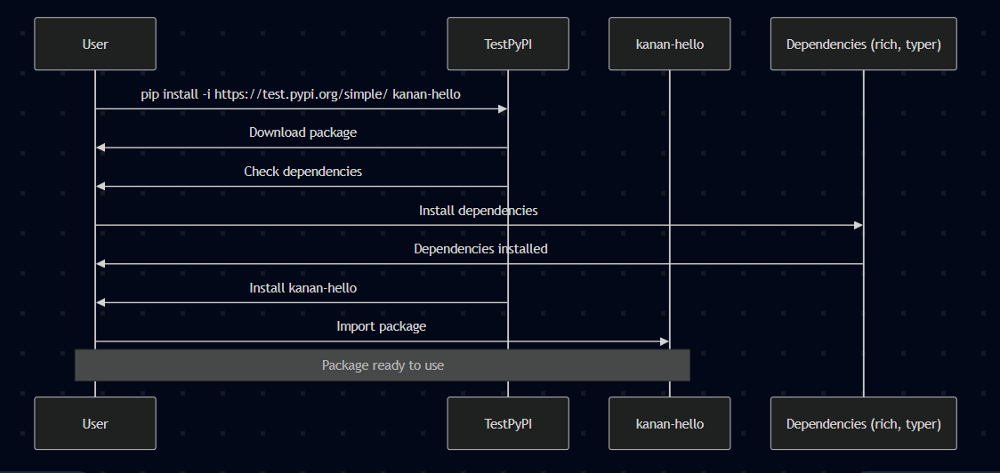
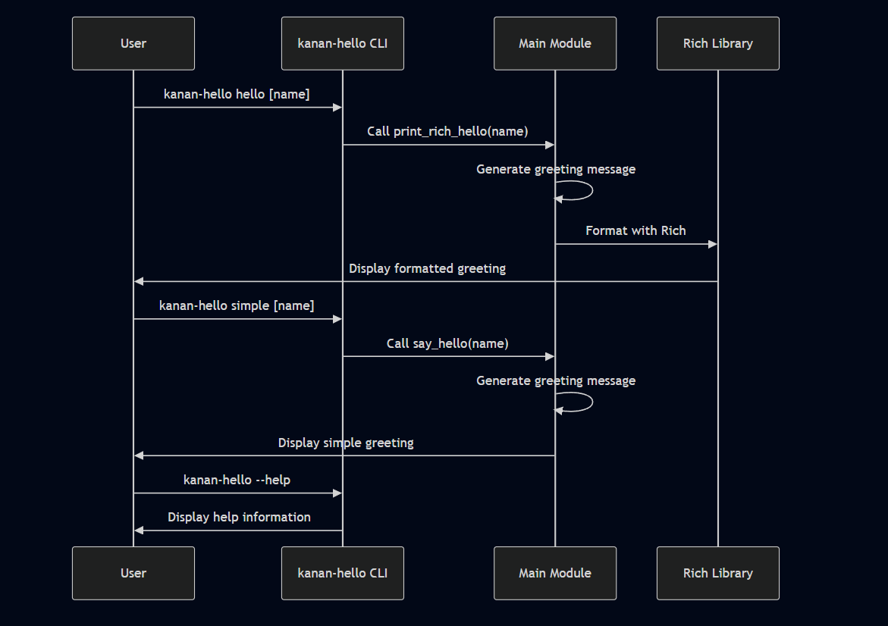
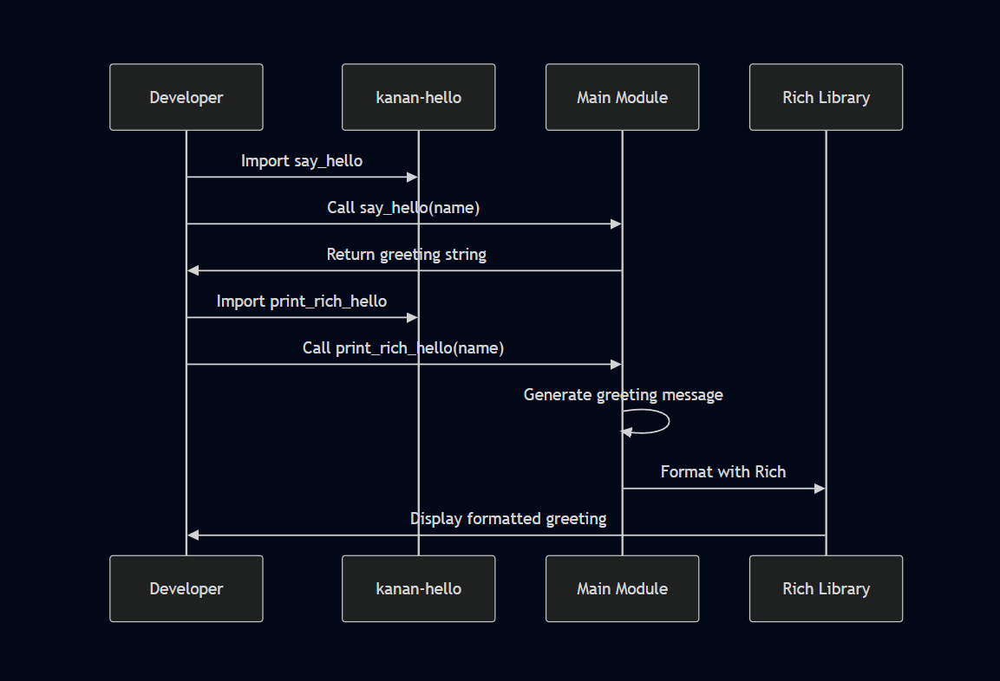
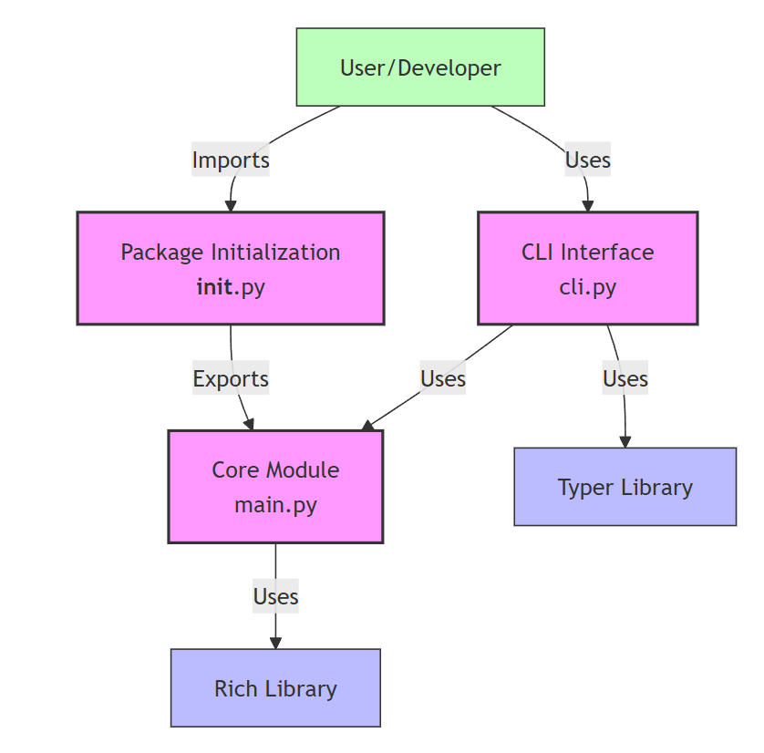
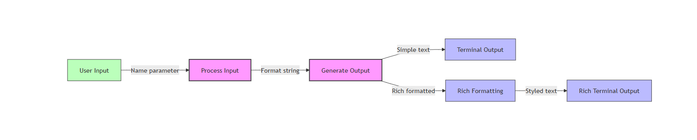
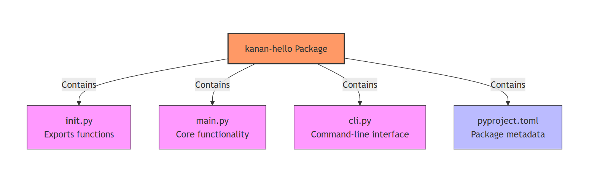

8# Developer Documentation


## 📚 Overview

This repository contains comprehensive developer documentation that serves as a guide for understanding, using, and contributing to our projects. The documentation follows best practices for technical writing, includes visual diagrams, and is structured for easy navigation.

<details>
<summary><b>🔍 Click to expand: What's included in this documentation</b></summary>

- **Markdown Guides**: Complete reference for writing documentation in Markdown
- **Sequence Diagrams**: Visual representations of process flows
- **Architecture Diagrams**: Component relationships and system structure
- **Design Documents**: Detailed explanations of design decisions
- **API References**: Comprehensive API documentation
- **Usage Guides**: Step-by-step instructions for using our tools
- **Contributing Guidelines**: How to contribute to our projects

</details>

## 🖼️ Visual Documentation

Our documentation includes various diagrams to help visualize complex concepts:

### Sequence Diagrams

<details>
<summary><b>Installation Sequence</b></summary>



*This diagram illustrates the step-by-step process of installing our package, from the initial pip command to the final import.*
</details>

<details>
<summary><b>CLI Usage Sequence</b></summary>



*This diagram shows the interaction flow when using our command-line interface, including command processing and output generation.*
</details>

<details>
<summary><b>Library Usage Sequence</b></summary>



*This diagram demonstrates how developers interact with our library, from importing functions to receiving formatted output.*
</details>

### Architecture Diagrams

<details>
<summary><b>Component Architecture</b></summary>



*This diagram shows the main components of our system and how they interact with each other.*
</details>

<details>
<summary><b>Data Flow</b></summary>



*This diagram illustrates how data moves through our system, from input to processing to output.*
</details>

<details>
<summary><b>Package Structure</b></summary>



*This diagram provides an overview of our package organization, showing the relationship between different modules and files.*
</details>

## 🚀 Getting Started

### Prerequisites

- Python 3.13
- pip (Python package installer)
- MkDocs (for viewing documentation locally)

### Installation

1. Clone this repository:
   ```
   git clone https://github.com/gulatikanan/bootcamp.git
   cd day_one/docs
   ```

2. Install MkDocs and the Material theme:
   ```
   pip install mkdocs mkdocs-material
   ```

3. Install additional dependencies:
   ```
   pip install pymdown-extensions
   ```
### Viewing Documentation Locally

Run the MkDocs development server:

```
mkdocs serve
```

Then open your browser and navigate to `http://127.0.0.1:8000/`.

## 📋 Documentation Structure

```

day_1/
│
├── docs/
│   ├── architecture_flow/
│   │   ├── architecture_dig_images/
│   │   │   ├── component.png
│   │   │   ├── data_flow.png
│   │   │   ├── package_structure.png
│   │   └── architecture_dig.md
│   │
│   ├── sequence_flow/
│   │   ├── sequence_dig_images/
│   │   │   ├── cli_usage.png
│   │   │   ├── installation.png
│   │   │   ├── library_usage.png
│   │   └── sequence_dig.md
│   │
│   ├── api_reference.md
│   ├── changelog.md
│   ├── cli_commands.md
│   ├── contributing.md
│   ├── daily_log.md
│   ├── design.md
│   ├── index.md
│   ├── installation.md
│   ├── license.md
│   ├── markdown_cheatsheet.md
│   ├── usage.md
│
├── .python-version
├── main.py
├── pyproject.toml
├── mkdocs.yml

```

## 📝 How to Use This Documentation

<details>
<summary><b>For New Developers</b></summary>

1. Start with the [Installation Guide](docs/installation.md) to set up the project
2. Read the [Usage Guide](docs/usage.md) to understand basic functionality
3. Explore the [API Reference](docs/api_reference.md) for detailed function documentation
4. Check the [Architecture Diagrams](docs/architecture_flow/arhictecture_dig.md) to understand the system structure

</details>

<details>
<summary><b>For Contributors</b></summary>

1. Read the [Contributing Guidelines](docs/contributing.md)
2. Review the [Design Document](docs/design_doc.md) to understand design decisions
3. Check the [Daily Log](docs/daily_log.md) for recent development activities
4. Use the [Markdown Cheatsheet](docs/markdown-cheatsheet.md) when writing documentation

</details>

<details>
<summary><b>For Documentation Maintainers</b></summary>

1. Familiarize yourself with MkDocs and the Material theme
2. Understand the documentation structure and organization
3. Follow the established style and formatting conventions
4. Update the changelog when making significant changes

</details>

## 🔄 Updating Documentation

### Adding New Content

1. Create a new Markdown file in the appropriate directory
2. Add the file to the navigation in `mkdocs.yml`
3. Link to the new file from relevant existing pages
4. Run `mkdocs serve` to preview your changes

### Updating Diagrams

1. Edit the diagram source files (Mermaid or Draw.io)
2. Export updated images to the `docs/images/` directory
3. Update any references to the diagrams in the documentation

## 🏗️ Building and Deploying

### Building Static Site

```
mkdocs build
```

This will create a `site/` directory with the static HTML site.

### Deploying to GitHub Pages

```
mkdocs gh-deploy
```

This will build the documentation and push it to the `gh-pages` branch.

## 👥 Contributing to Documentation

We welcome contributions to improve our documentation! Please follow these steps:

1. Fork the repository
2. Create a new branch for your changes
3. Make your changes following our style guidelines
4. Submit a pull request with a clear description of your improvements

See [Contributing Guidelines](docs/contributing.md) for more details.

## 📊 Documentation Quality Metrics

We track the following metrics to ensure high-quality documentation:

- **Completeness**: All features and APIs are documented
- **Accuracy**: Documentation matches the actual code behavior
- **Clarity**: Explanations are clear and concise
- **Examples**: Each feature includes usage examples
- **Diagrams**: Complex concepts are illustrated visually

## 📞 Getting Help

If you have questions about the documentation:

- Open an issue on GitHub
- Contact the documentation team at kanangulati7@gmail.com
- Join our Slack channel #documentation

## 📄 License

This documentation is licensed under the MIT License - see the [LICENSE](docs/license.md) file for details.


