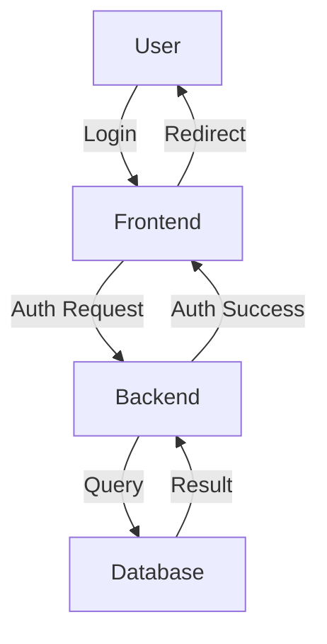

# Markdown Cheatsheet

## Basic Syntax

### Headings

# Heading 1
## Heading 2
### Heading 3
#### Heading 4
##### Heading 5
###### Heading 6

### Text Formatting

Bold text
Italic text
Strikethrough
Inline code


**Bold text**  
*Italic text*  
~~Strikethrough~~  
`Inline code`

### Lists

#### Unordered Lists

- Item 1
- Item 2
  - Nested item 2.1
  - Nested item 2.2
- Item 3


#### Ordered Lists

1. First item
2. Second item
3. Third item
   1. Nested item 3.1
   2. Nested item 3.2


### Links

Link text
Link with title
Reference link


[Link text](https://www.example.com)  
[Link with title](https://www.example.com "Link title")  
[Reference link][reference]

[reference]: https://www.example.com

### Images


### Blockquotes

This is a blockquote

This is a nested blockquote


> This is a blockquote  
>  
> > This is a nested blockquote

### Horizontal Rule

---

## Advanced Syntax

### Code Blocks

```python
def hello_world():
    print("Hello, World!")
```

### Tables

```
| Header 1 | Header 2 | Header 3 |
|----------|----------|----------|
| Cell 1   | Cell 2   | Cell 3   |
| Cell 4   | Cell 5   | Cell 6   |
```

| Header 1 | Header 2 | Header 3 |
|----------|----------|----------|
| Cell 1   | Cell 2   | Cell 3   |
| Cell 4   | Cell 5   | Cell 6   |

###Task Lists

```
- [x] Completed task
- [ ] Incomplete task
- [ ] Another task
```

- [x] Completed task
- [ ] Incomplete task
- [ ] Another task

### Footnotes

```
Here's a sentence with a footnote. [^1]

[^1]: This is the footnote.
```

Here's a sentence with a footnote. [^1]

[^1]: This is the footnote.


### Emoji

```
:smile: :heart: :thumbsup:
```

\:smile: \:heart: \:thumbsup:


### Diagrams with Mermaid


---

### ❌ What *Not* to Do
Don't put a `plaintext` code block right after the Mermaid block **without closing the previous one properly.** GitHub sees it all as one big mess and flips out.

---

### ✅ Pro Tips

- Mermaid diagrams must start **and end cleanly** with the same triple backticks: `````mermaid ... `````
- **Don't** add another code block (`plaintext`, `bash`, etc.) inside the Mermaid block.
- If you need to explain the diagram, add a regular paragraph *before* or *after*, like so:

```markdown
This is a basic flow diagram using Mermaid:




## GitHub-Specific Markdown

### Collapsible Sections

<details>
<summary>Click to expand</summary>

This content is hidden until clicked.

</details>

### Keyboard Keys

Press <kbd>Ctrl</kbd> + <kbd>C</kbd> to copy text.

### Alerts (GitHub Only)

> [!NOTE]  
> This is a note.

> [!WARNING]  
> This is a warning.

> [!TIP]  
> This is a tip.

## Best Practices

1. **Use headings hierarchically**: Don't skip levels (e.g., don't go from `#` to `###`).
2. **Be consistent with formatting**: Choose a style for lists, code blocks, etc. and stick with it.
3. **Use reference links** for URLs that appear multiple times.
4. **Add alt text to images** for accessibility.
5. **Preview your Markdown** before committing to ensure it renders correctly.