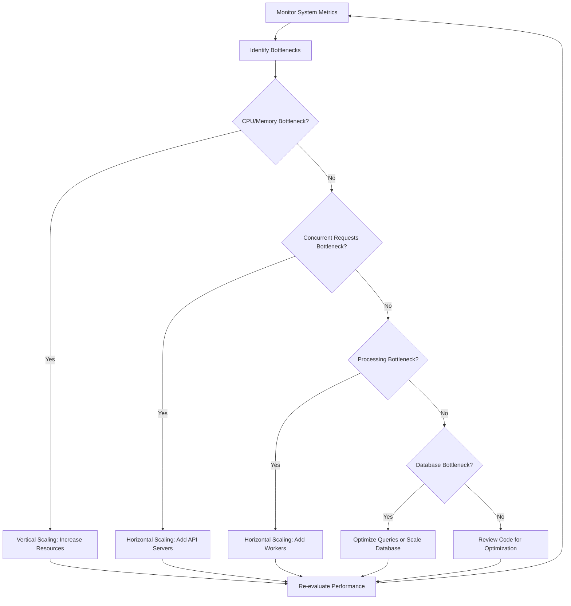

# 🚀 Operationalization: Scientific Publication Data Extraction System

## 📋 Table of Contents
1. [Deployment](#1-deployment-)
2. [Monitoring and Maintenance](#2-monitoring-and-maintenance-)
3. [Scaling](#3-scaling-)
4. [Backup and Recovery](#4-backup-and-recovery-)
5. [Security](#5-security-)
6. [Troubleshooting](#6-troubleshooting-)
7. [Performance Tuning](#7-performance-tuning-)
8. [Conclusion](#8-conclusion-)

## 1. Deployment 🚀

### 1.1 Deployment Options

| Deployment Type | Description | Recommended For |
|-----------------|-------------|-----------------|
| **🖥️ Local Deployment** | Run the system on a local machine or server | Development, testing, small-scale usage |
| **🐳 Docker Deployment** | Run the system using Docker containers | Production, consistent environments |
| **☁️ Cloud Deployment** | Deploy Docker containers to cloud services | Scalable production environments |

### 1.2 Local Deployment Steps

**Prerequisites**
- Python 3.9 or higher
- Git
- Windows 11 (or other OS with appropriate adjustments)

**Installation**

```bash
# Clone the repository
git clone https://github.com/your-org/scientific-publication-extraction.git
cd scientific-publication-extraction

# Set up virtual environment
python -m venv venv
venv\Scripts\activate  # On Windows
# source venv/bin/activate  # On Unix/Linux

# Install dependencies
pip install -r requirements.txt

# Run setup script
python setup_windows.py
```

**Configuration**
1. Create a `.env` file based on `.env.example`
2. Adjust settings as needed

**Database Initialization**
```bash
python -m src.cli.main init-db
```

**Start the API Server**
```bash
python -m src.cli.main serve
```

### 1.3 Docker Deployment Steps

**Prerequisites**
1. Docker
2. Docker Compose

**Build and Start Containers**
```bash
# Build Docker images
docker-compose build

# Start containers
docker-compose up -d
```

**Configuration**
1. Environment variables can be set in `docker-compose.yml`
2. Volume mounts for persistent data are configured in `docker-compose.yml`

**Verify Deployment**
```bash
# Check container status
docker-compose ps

# View logs
docker-compose logs -f
```

### 1.4 Cloud Deployment (AWS Example)

**Prerequisites**
1. AWS account
2. AWS CLI configured
3. ECR repository created

**Push Docker Images to ECR**
```bash
# Login to ECR
aws ecr get-login-password --region us-east-1 | docker login --username AWS --password-stdin your-account-id.dkr.ecr.us-east-1.amazonaws.com

# Tag images
docker tag scifig:latest your-account-id.dkr.ecr.us-east-1.amazonaws.com/scifig:latest

# Push images
docker push your-account-id.dkr.ecr.us-east-1.amazonaws.com/scifig:latest
```

**Deploy to ECS**
1. Create ECS cluster
2. Create task definition using the ECR image
3. Create ECS service
4. Configure load balancer if needed

**Configure Environment Variables**
1. Set environment variables in the ECS task definition

## 2. Monitoring and Maintenance 📊

### 2.1 Logging Strategy

#### 2.1.1 Log Levels

| Level | Usage |
|-------|-------|
| **DEBUG** | Detailed information for debugging |
| **INFO** | General operational information |
| **WARNING** | Potential issues that don't affect operation |
| **ERROR** | Errors that affect specific operations |
| **CRITICAL** | Critical errors that affect the entire system |

#### 2.1.2 Log Storage

| Storage | Retention | Use Case |
|---------|-----------|----------|
| **Local Files** | 7 days | Development, small deployments |
| **Centralized Logging** | 30+ days | Production deployments |
| **Log Rotation** | Configurable | Prevent disk space issues |

### 2.2 Monitoring

| Metric | Description | Alert Threshold |
|--------|-------------|----------------|
| API Response Time | Time taken to respond to API requests | > 500ms |
| Processing Time | Time taken to process a paper | > 30 seconds |
| Error Rate | Percentage of operations resulting in errors | > 5% |
| CPU Usage | CPU utilization of the system | > 80% |
| Memory Usage | Memory utilization of the system | > 80% |
| Disk Usage | Disk space utilization | > 80% |
| Queue Length | Number of papers waiting to be processed | > 100 |
| External API Availability | Availability of BioC-PMC and PubTator3 APIs | < 99% |

### 2.3 Health Checks

```python
@router.get("/health", tags=["Health"])
def health_check():
    """
    Health check endpoint.
    
    Returns:
        Dictionary containing health status.
    """
    # Check database connection
    try:
        db = SessionLocal()
        db.execute("SELECT 1")
        db_status = "healthy"
    except Exception as e:
        db_status = f"unhealthy: {str(e)}"
    finally:
        db.close()
    
    # Check external API availability
    try:
        bioc_client = BioCClient()
        bioc_client.check_availability()
        bioc_status = "healthy"
    except Exception as e:
        bioc_status = f"unhealthy: {str(e)}"
    
    try:
        pubtator_client = PubTatorClient()
        pubtator_client.check_availability()
        pubtator_status = "healthy"
    except Exception as e:
        pubtator_status = f"unhealthy: {str(e)}"
    
    # Overall status
    overall_status = "healthy" if all(s == "healthy" for s in [db_status, bioc_status, pubtator_status]) else "unhealthy"
    
    return {
        "status": overall_status,
        "timestamp": datetime.utcnow().isoformat(),
        "components": {
            "database": db_status,
            "bioc_api": bioc_status,
            "pubtator_api": pubtator_status
        }
    }
```

### 2.4 Maintenance Tasks

| Task | Frequency | Description |
|------|-----------|-------------|
| Database Optimization | Weekly | Optimize database for performance |
| Log Rotation | Daily | Rotate logs to prevent disk space issues |
| Dependency Updates | Monthly | Update dependencies to latest versions |
| Security Patches | As needed | Apply security patches |
| Database Backup | Daily | Back up database to prevent data loss |
| System Restart | As needed | Restart system to apply updates |

## 3. Scaling ⚖️

### 3.1 Vertical Scaling

#### When to Scale Vertically
- ✅ When processing speed is limited by CPU or memory
- ✅ When database performance is slow
- ✅ When the system is handling a moderate workload

#### How to Scale Vertically
- ✅ Increase CPU resources
- ✅ Increase memory allocation
- ✅ Use faster storage (SSD)
- ✅ Optimize code for better performance

#### Limitations
- ❌ Limited by hardware capabilities
- ❌ Potential downtime during upgrades
- ❌ Cost increases non-linearly with performance

### 3.2 Horizontal Scaling

#### When to Scale Horizontally
- ✅ When handling a large number of concurrent requests
- ✅ When processing a large number of papers
- ✅ When high availability is required

#### How to Scale Horizontally
- ✅ Add more API server instances behind a load balancer
- ✅ Add more worker instances for paper processing
- ✅ Use a distributed task queue (e.g., Celery with Redis)
- ✅ Use a distributed database if DuckDB becomes a bottleneck

#### Considerations
- ⚠️ Ensure stateless API design
- ⚠️ Handle shared resources properly (e.g., database)
- ⚠️ Implement proper load balancing
- ⚠️ Consider network latency between components

### 3.3 Scaling Strategy



## 4. Backup and Recovery 💾

### 4.1 Backup Strategy

| Data Type | Backup Frequency | Retention Period | Method |
|-----------|------------------|-----------------|--------|
| Database | Daily | 30 days | Full backup |
| Configuration | After changes | 10 versions | Version control |
| Logs | Daily | 90 days | Log archiving |
| Code | Continuous | Indefinite | Version control |

### 4.2 Backup Implementation

```python
def backup_database():
    """
    Back up the DuckDB database.
    
    Returns:
        Path to the backup file.
    """
    # Get database path from settings
    db_path = settings.duckdb_path
    
    # Create backup directory if it doesn't exist
    backup_dir = Path("data/backups")
    backup_dir.mkdir(parents=True, exist_ok=True)
    
    # Create backup filename with timestamp
    timestamp = datetime.now().strftime("%Y%m%d_%H%M%S")
    backup_path = backup_dir / f"publications_{timestamp}.duckdb"
    
    # Copy database file
    shutil.copy2(db_path, backup_path)
    
    # Compress backup
    with zipfile.ZipFile(f"{backup_path}.zip", "w", zipfile.ZIP_DEFLATED) as zipf:
        zipf.write(backup_path, arcname=backup_path.name)
    
    # Remove uncompressed backup
    backup_path.unlink()
    
    # Return path to compressed backup
    return f"{backup_path}.zip"
```

### 4.3 Recovery Procedures

#### Database Recovery
- Stop the application
- Identify the appropriate backup file
- Extract the backup file if compressed
- Replace the corrupted database file with the backup
- Start the application
- Verify data integrity

#### Configuration Recovery
- Identify the appropriate configuration version
- Restore the configuration files
- Restart the application if necessary
- Verify configuration

#### Full System Recovery
- Deploy the application code
- Restore configuration
- Restore database
- Start the application
- Verify system functionality

### 4.4 Disaster Recovery

| Scenario | Recovery Time Objective (RTO) | Recovery Point Objective (RPO) | Procedure |
|----------|-------------------------------|-------------------------------|-----------|
| Server Failure | 1 hour | 24 hours | Deploy to new server, restore from backup |
| Database Corruption | 30 minutes | 24 hours | Restore database from backup |
| Application Error | 15 minutes | 0 (no data loss) | Roll back to previous version |
| Complete Data Loss | 4 hours | 24 hours | Restore from off-site backup |

## 5. Security 🔒

### 5.1 Authentication and Authorization

#### API Authentication
- ✅ API key authentication for all endpoints
- ✅ Token-based authentication with expiration
- ✅ Secure storage of API keys (hashed)

#### Authorization
- ✅ Role-based access control (admin, user)
- ✅ Admin endpoints restricted to admin users
- ✅ Read-only access for regular users

#### Implementation

```python
def get_current_user(
    api_key: str = Security(api_key_header),
    db: Session = Depends(get_db)
):
    """
    Get the current user based on the API key.
    
    Args:
        api_key: The API key from the request header.
        db: Database session.
        
    Returns:
        User object if authenticated, otherwise raises HTTPException.
    """
    user = authenticate_api_key(api_key, db)
    if user is None:
        raise HTTPException(
            status_code=status.HTTP_401_UNAUTHORIZED,
            detail="Invalid API key",
            headers={"WWW-Authenticate": "ApiKey"},
        )
    return user
```

### 5.2 Data Security

#### Data Protection
- ✅ No storage of sensitive user data
- ✅ Database file permissions restricted
- ✅ Secure handling of configuration data

#### API Security
- ✅ Input validation for all API endpoints
- ✅ Rate limiting to prevent abuse
- ✅ HTTPS for all API communications
- ✅ Proper error handling to avoid information leakage

#### Implementation

```python
# Rate limiting middleware
@app.middleware("http")
async def rate_limit_middleware(request: Request, call_next):
    """
    Rate limiting middleware.
    
    Args:
        request: The incoming request.
        call_next: The next middleware or route handler.
        
    Returns:
        Response from the next middleware or route handler.
    """
    # Get client IP
    client_ip = request.client.host
    
    # Check rate limit
    if not rate_limiter.allow_request(client_ip):
        return JSONResponse(
            status_code=status.HTTP_429_TOO_MANY_REQUESTS,
            content={"detail": "Too many requests"},
        )
    
    # Process request
    response = await call_next(request)
    
    return response
```

### 5.3 Dependency Security

#### Dependency Management
- ✅ Regular updates of dependencies
- ✅ Vulnerability scanning in CI/CD pipeline
- ✅ Pinned dependency versions

#### Docker Security
- ✅ Minimal base image (python:3.9-slim)
- ✅ Non-root user for running the application
- ✅ Minimal permissions principle
- ✅ No unnecessary packages installed

#### Implementation

```dockerfile
# Use multi-stage build for smaller image
FROM python:3.9-slim AS builder

WORKDIR /app

# Install build dependencies
RUN apt-get update && apt-get install -y --no-install-recommends \
    build-essential \
    && apt-get clean \
    && rm -rf /var/lib/apt/lists/*

# Copy requirements and install dependencies
COPY requirements.txt .
RUN pip install --no-cache-dir -r requirements.txt

# Final stage
FROM python:3.9-slim

WORKDIR /app

# Copy installed packages from builder
COPY --from=builder /usr/local/lib/python3.9/site-packages /usr/local/lib/python3.9/site-packages
COPY --from=builder /usr/local/bin /usr/local/bin

# Create non-root user
RUN useradd -m appuser

# Copy application code
COPY --chown=appuser:appuser . .

# Create necessary directories with proper permissions
RUN mkdir -p data/db data/input data/output data/temp && \
    chown -R appuser:appuser data

# Switch to non-root user
USER appuser

# Expose port for API
EXPOSE 8000

# Set entrypoint
ENTRYPOINT ["python", "-m", "src.cli.main"]

# Set default command
CMD ["--help"]
```

## 6. Troubleshooting 🔍

### 6.1 Common Issues and Solutions

| Issue | Possible Causes | Solutions |
|-------|----------------|-----------|
| API Server Not Starting | • Port already in use<br>• Missing dependencies<br>• Configuration errors | • Check if another process is using the port<br>• Verify all dependencies are installed<br>• Check configuration file for errors |
| Database Connection Error | • Database file not found<br>• Permission issues<br>• Corrupted database file | • Verify database file path<br>• Check file permissions<br>• Restore from backup if corrupted |
| Paper Processing Failures | • External API unavailable<br>• Rate limiting<br>• Invalid paper ID<br>• Timeout | • Check external API status<br>• Adjust rate limiting settings<br>• Verify paper ID format<br>• Increase timeout settings |
| High Memory Usage | • Processing too many papers simultaneously<br>• Memory leaks<br>• Large response data | • Adjust batch size<br>• Check for memory leaks<br>• Implement pagination for large responses |
| Slow API Response | • Database queries not optimized<br>• High system load<br>• Network latency | • Optimize database queries<br>• Scale resources<br>• Implement caching |

### 6.2 Diagnostic Tools

#### 6.2.1 Log Analysis

**Tools:**
- Log file viewers
- Log aggregation systems (e.g., ELK stack)
- Log filtering and searching

**Commands:**
```bash
# View recent logs
tail -f logs/app.log

# Search for errors
grep "ERROR" logs/app.log

# Count occurrences of specific errors
grep "ConnectionError" logs/app.log | wc -l
```

#### 6.2.2 System Monitoring

**Tools:**
- Docker stats
- System monitoring tools (e.g., htop, glances)
- Resource usage tracking

**Commands:**
```bash
# View Docker container stats
docker stats

# Check system resources
htop

# Monitor disk usage
df -h
```

### 6.3 Debugging Procedures

#### API Issues
- Check API server logs for errors
- Verify API server is running
- Test API endpoints with curl or Postman
- Check for authentication issues
- Verify request and response formats

#### Processing Issues
- Check worker logs for errors
- Verify external API connectivity
- Test processing with a known good paper ID
- Check for rate limiting issues
- Verify database connectivity

#### Database Issues
- Check database file exists and is accessible
- Verify database schema
- Test basic queries
- Check for corruption
- Restore from backup if necessary

### 6.4 Support Runbook

#### Level 1 Support
- Collect basic information (error messages, logs, steps to reproduce)
- Check common issues and solutions
- Restart services if necessary
- Escalate to Level 2 if unresolved

#### Level 2 Support
- Analyze logs and error messages
- Check system resources
- Test API endpoints and functionality
- Check database integrity
- Apply known fixes
- Escalate to Level 3 if unresolved

#### Level 3 Support
- Detailed code and configuration analysis
- Database debugging
- External API troubleshooting
- Performance analysis
- Implement fixes or workarounds
- Update documentation with new issues and solutions

## 7. Performance Tuning ⚡

### 7.1 Performance Metrics

| Metric | Target | Measurement Method |
|--------|--------|-------------------|
| API Response Time | < 200ms (p95) | API monitoring, request timing |
| Paper Processing Time | < 10 seconds per paper | Processing job timing |
| Database Query Time | < 100ms (p95) | Query timing, database monitoring |
| Concurrent API Requests | > 100 requests/second | Load testing |
| Memory Usage | < 500MB per process | System monitoring |
| CPU Usage | < 70% sustained | System monitoring |

### 7.2 Database Optimization

#### Query Optimization
- ✅ Use indexes for frequently queried columns
- ✅ Optimize JOIN operations
- ✅ Use appropriate data types
- ✅ Limit result sets

#### Schema Optimization
- ✅ Normalize data appropriately
- ✅ Use efficient data types
- ✅ Create indexes for foreign keys

#### Implementation

```python
# Create indexes for frequently queried columns
def create_indexes():
    """Create indexes for frequently queried columns."""
    db = SessionLocal()
    try:
        # Create index for paper title
        db.execute("CREATE INDEX IF NOT EXISTS idx_papers_title ON papers (title)")
        
        # Create index for figure captions
        db.execute("CREATE INDEX IF NOT EXISTS idx_figures_caption ON figures (caption)")
        
        # Create index for entity type
        db.execute("CREATE INDEX IF NOT EXISTS idx_entities_type ON entities (entity_type)")
        
        # Create index for job status
        db.execute("CREATE INDEX IF NOT EXISTS idx_jobs_status ON jobs (status)")
        
        db.commit()
    finally:
        db.close()
```

### 7.3 API Optimization

#### Response Optimization
- ✅ Implement pagination for large result sets
- ✅ Use appropriate data serialization
- ✅ Minimize response payload size

#### Request Optimization
- ✅ Validate input data efficiently
- ✅ Use appropriate HTTP methods
- ✅ Implement caching for frequent requests

#### Implementation

```python
# Implement pagination for large result sets
@router.get("/papers", response_model=PaginatedPaperResponse)
def get_papers(
    skip: int = Query(0, ge=0),
    limit: int = Query(10, ge=1, le=100),
    db: Session = Depends(get_db)
):
    """
    Get a list of papers with pagination.
    
    Args:
        skip: Number of records to skip.
        limit: Maximum number of records to return.
        db: Database session.
        
    Returns:
        Paginated list of papers.
    """
    storage_service = StorageService(db)
    
    # Get total count
    total = storage_service.count_papers()
    
    # Get papers with pagination
    papers = storage_service.get_papers(skip=skip, limit=limit)
    
    return {
        "items": papers,
        "total": total,
        "skip": skip,
        "limit": limit
    }
```

### 7.4 Processing Optimization

#### Batch Processing
- ✅ Process papers in batches
- ✅ Optimize external API calls
- ✅ Implement parallel processing

#### Resource Management
- ✅ Limit concurrent processing
- ✅ Implement backoff strategies for API calls
- ✅ Optimize memory usage

#### Implementation

```python
# Process papers in parallel
def process_papers_parallel(paper_ids: List[str], max_workers: int = 4) -> Dict:
    """
    Process papers in parallel.
    
    Args:
        paper_ids: List of paper IDs to process.
        max_workers: Maximum number of worker threads.
        
    Returns:
        Dictionary containing processing results.
    """
    # Create database session
    db = SessionLocal()
    
    try:
        # Create storage service
        storage_service = StorageService(db)
        
        # Create job
        job = storage_service.create_job("paper_processing", paper_ids)
        
        # Update job status
        storage_service.update_job(job.id, {"status": JobStatus.PROCESSING})
        
        processed = 0
        failed = 0
        
        # Process papers in parallel
        with ThreadPoolExecutor(max_workers=max_workers) as executor:
            # Create extraction service for each worker
            extraction_services = [ExtractionService(SessionLocal()) for _ in range(max_workers)]
            
            # Submit tasks
            futures = {executor.submit(extraction_services[i % max_workers].process_paper, paper_id): paper_id 
                      for i, paper_id in enumerate(paper_ids)}
            
            # Process results as they complete
            for future in as_completed(futures):
                paper_id = futures[future]
                try:
                    future.result()
                    processed += 1
                except Exception as e:
                    logger.error(f"Error processing paper {paper_id}: {str(e)}")
                    failed += 1
                
                # Update job status
                storage_service.update_job(job.id, {
                    "processed_papers": processed,
                    "failed_papers": failed
                })
        
        # Update job status
        storage_service.update_job(job.id, {
            "status": JobStatus.COMPLETED,
            "processed_papers": processed,
            "failed_papers": failed
        })
        
        return {
            "job_id": job.id,
            "processed": processed,
            "failed": failed
        }
        
    finally:
        db.close()
        
        # Close extraction service database connections
        for service in extraction_services:
            service.close()
```

### 7.5 Caching Strategy

#### Cache Levels
- ✅ In-memory cache for frequent queries
- ✅ External API response caching
- ✅ Result set caching

#### Cache Invalidation
- ✅ Time-based invalidation
- ✅ Event-based invalidation
- ✅ Manual invalidation

#### Implementation

```python
# Simple in-memory cache
class Cache:
    """Simple in-memory cache with TTL."""
    
    def __init__(self, ttl: int = 3600):
        """
        Initialize the cache.
        
        Args:
            ttl: Time-to-live in seconds.
        """
        self.cache = {}
        self.ttl = ttl
        self.lock = Lock()
    
    def get(self, key: str) -> Any:
        """
        Get a value from the cache.
        
        Args:
            key: Cache key.
            
        Returns:
            Cached value or None if not found or expired.
        """
        with self.lock:
            if key not in self.cache:
                return None
            
            value, timestamp = self.cache[key]
            
            # Check if expired
            if time.time() - timestamp > self.ttl:
                del self.cache[key]
                return None
            
            return value
    
    def set(self, key: str, value: Any) -> None:
        """
        Set a value in the cache.
        
        Args:
            key: Cache key.
            value: Value to cache.
        """
        with self.lock:
            self.cache[key] = (value, time.time())
    
    def invalidate(self, key: str) -> None:
        """
        Invalidate a cache entry.
        
        Args:
            key: Cache key to invalidate.
        """
        with self.lock:
            if key in self.cache:
                del self.cache[key]
    
    def clear(self) -> None:
        """Clear the entire cache."""
        with self.lock:
            self.cache.clear()
```

## 8. Conclusion 🏁

The operationalization of the Scientific Publication Data Extraction System involves careful planning and implementation of deployment, monitoring, scaling, backup, security, troubleshooting, and performance tuning strategies. By following the guidelines and procedures outlined in this document, the system can be operated reliably, securely, and efficiently.

Key operational aspects include:

- ✅ **Deployment Options**: Local, Docker, and cloud deployment options with clear setup instructions
- ✅ **Monitoring and Maintenance**: Comprehensive logging, monitoring, health checks, and maintenance tasks
- ✅ **Scaling Strategy**: Vertical and horizontal scaling approaches to handle increased workload
- ✅ **Backup and Recovery**: Regular backups and clear recovery procedures for data protection
- ✅ **Security Measures**: Authentication, authorization, data protection, and dependency security
- ✅ **Troubleshooting Procedures**: Common issues, diagnostic tools, and support runbook
- ✅ **Performance Tuning**: Database, API, and processing optimizations for better performance

By implementing these operational practices, the system can provide reliable and efficient extraction of data from scientific publications, meeting the needs of users while maintaining good performance and security.
